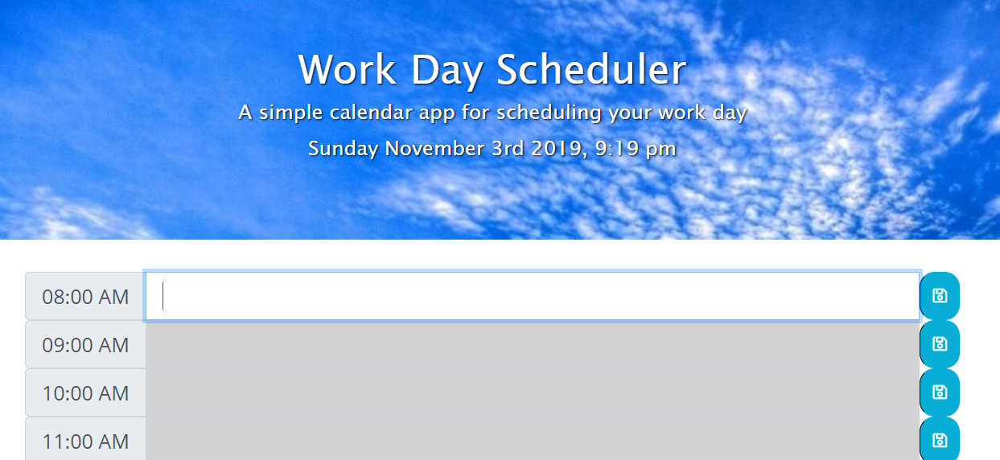

# dayPlanner
Created a dynamic day planner that allows entries to be saved on local storage.

## This project contains elements of:
* HTML
* CSS
* Bootstrap
* Javascript
* jQuery
* Moment.js

### The basic functionality:
Allows a user to save an entry of text for which ever hour they choose, whilst saving in their local storage.
The planner also has functions to let the user know if the hour is in the past, present or future.

#### Here is a screenshot of my Day Planner!

